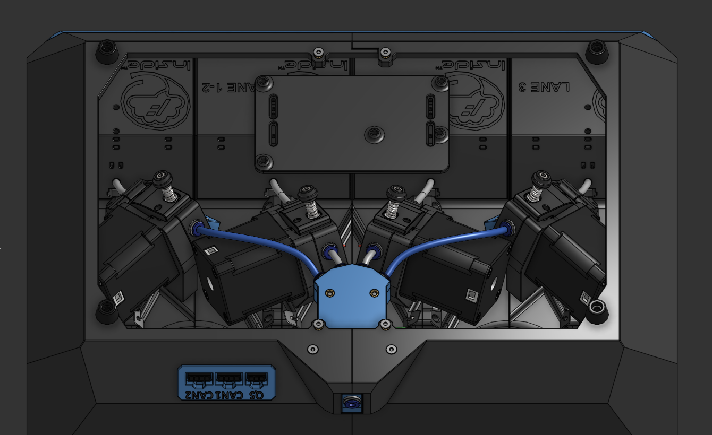

# NEMA 17 48mm Motors

* This mod allows the use of the larger NEMA17 motors that many people already have with the direct drive extruders for QuattroBox
* Only the two middle lane extruders are modified. Use the normal ones from the QuattroBox repo for the other two.
* The box base needed to be made taller to fit the larger extruder mounting plates, so you need 4mm longer screws to hold that in place.